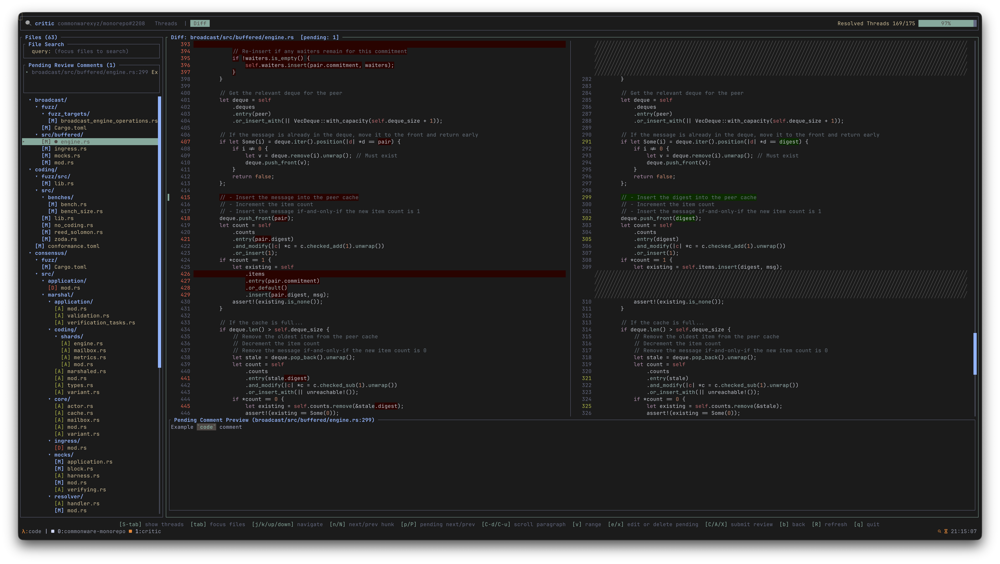
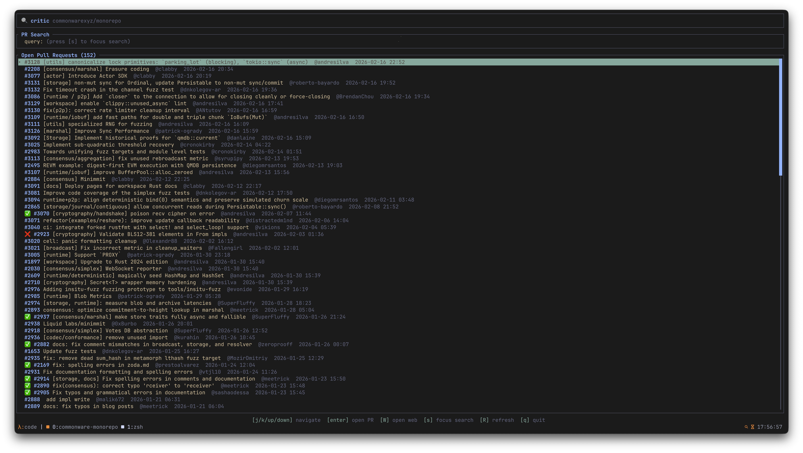
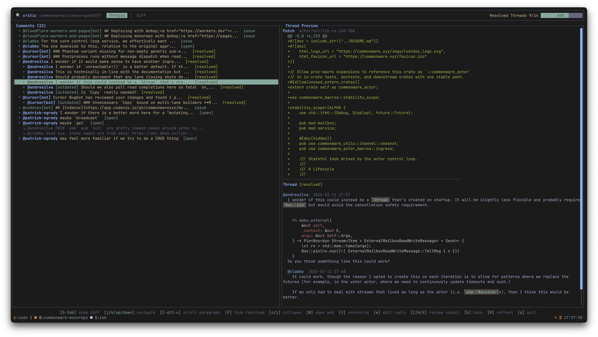

# critic

`critic` is a terminal-first GitHub pull request review client.

<p align="center">
  
</p>

> [!WARNING]
> `critic` is still in early development. The UI, features, and keybindings are all subject to change. Feedback and contributions are very welcome!

## Features

- Authenticate with GitHub using your existing `gh` login (`gh auth token`).
- Fuzzy-find open pull requests.
- Navigate review threads and issue comments in a split-pane review UI.
- Render markdown in thread previews, including lists, emphasis, inline code, and fenced code blocks.
- Review PR diffs with `difft` aligned output, syntax highlighting, hunk navigation, and file tree navigation.
- Leave pending inline diff comments and submit them in a review batch.
- Persist in-progress draft review comments to disk so interrupted sessions can recover.
- Open the active PR/comment directly in the browser when needed.

## Installation

### Dependencies

- `gh` (GitHub CLI): used for authentication.
- `difft` (difftastic, with aligned lines): used for diff rendering.

> [!WARNING]
>
> This tool requires difftastic with `aligned_lines` support in JSON output. This feature is available in
> `main`, though hasn't yet landed in a release.
>
> To build `difftastic` from source:
> ```sh
> # Clone with 'jj'
> jj git clone git@github.com:Wilfred/difftastic.git --colocate
>
> # Or, clone with 'git'
> git clone git@github.com:Wilfred/difftastic.git
>
> # Install 'difft' with the 'aligned_lines' feature
> cd difftastic && cargo install --path .
> ```

### Install From Source

```sh
cargo install critic
```

If you are installing from a local checkout instead of crates.io:

```sh
cargo install --path .
```

### Install Pre-Built Binary

With `cargo-binstall`:

```sh
cargo binstall critic
```

Manual download:

1. Open the latest GitHub release.
2. Download the archive for your target platform.
3. Extract and place the `critic` binary on your `PATH`.

## Screens

### PR Search

Use this screen to fuzzy-filter open pull requests and choose one to review.

<p align="center">
  
</p>

| Key | Action |
| --- | --- |
| `j` / `k` / `up` / `down` | Move selection |
| `enter` | Open selected pull request |
| `W` | Open selected pull request in browser |
| `s` | Focus search input |
| `u` | Toggle scope (`all`/`author`/`reviewer`) |
| `i` | Toggle status (`all`/`draft`/`ready`/`approved`/`rejected`) |
| `o` | Toggle sort mode (updated/created) |
| `R` | Refresh open pull request list |
| `q` | Quit |

When search input is focused:

| Key | Action |
| --- | --- |
| `type` | Edit query |
| `backspace` | Delete previous character |
| `enter` / `esc` | Unfocus search input |

### PR Review

#### Comment Tab

Use this tab for conversational review: read threads, inspect context, reply, and resolve/unresolve review threads.

<p align="center">
  
</p>

| Key | Action |
| --- | --- |
| `S-tab` | Show Diff tab |
| `j` / `k` / `up` / `down` | Move selection |
| `C-d` / `C-u` | Scroll paragraph |
| `o` / `z` | Collapse/expand selected thread group |
| `W` | Open selected comment in browser |
| `f` | Show/hide resolved threads |
| `t` | Resolve/unresolve selected thread |
| `e` | Edit staged reply |
| `s` | Send staged reply (when present), otherwise focus comment search |
| `/` | Focus comment search |
| `x` | Clear staged reply |
| `C` / `A` / `X` | Submit review (comment / approve / request changes) |
| `b` | Back to PR search |
| `R` | Refresh PR data |
| `q` | Quit |

When comment search is focused:

| Key | Action |
| --- | --- |
| `type` | Edit query |
| `backspace` | Delete previous character |
| `enter` / `esc` | Unfocus comment search |

#### Diff Review Tab

Use this tab for code-level review: browse changed files, move by hunk, create/edit/delete pending inline comments, and submit a review batch.

<p align="center">
  
</p>

General diff navigation:

| Key | Action |
| --- | --- |
| `S-tab` | Show Threads tab |
| `tab` | Toggle focus between file tree and diff pane |
| `j` / `k` / `up` / `down` | Move selection in focused pane |
| `n` / `N` or `]` / `[` | Next/previous hunk |
| `p` / `P` | Next/previous pending inline comment |
| `q` | Quit |

When diff pane is focused:

| Key | Action |
| --- | --- |
| `C-d` / `C-u` | Scroll paragraph |
| `v` | Start/stop visual range selection (restricted to valid hunk range) |
| `esc` | Cancel visual selection |
| `e` | Leave/edit pending inline comment |
| `x` | Delete pending inline comment (when on an existing pending range) |
| `C` / `A` / `X` | Submit review (comment / approve / request changes) |
| `b` | Back to PR search |
| `R` | Refresh PR data |

When file tree is focused:

| Key | Action |
| --- | --- |
| `s` | Focus file search |
| `o` / `z` | Collapse/expand directory |

When file search is focused:

| Key | Action |
| --- | --- |
| `type` | Edit file filter query |
| `backspace` | Delete previous character |
| `enter` / `esc` | Unfocus file search |

## License

See [`LICENSE.md`](./LICENSE.md)

## Slop Disclaimer

The vast majority of this tool was written by Codex. It is useful in practice, but it may contain bugs, rough edges, odd code, or missing validations.

If you hit one, please open an issue with reproduction steps (or better, a patch).
